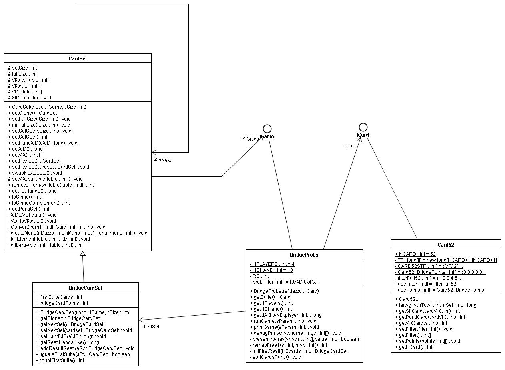

# JCardLib
A java lib for cards games, with exstensions for Bridge

-  Level 1: Cardset, card52: for generic Cards, and for 52 card set (France)
-  level 2: BridgCardSet, bridgeProbs, for Brige: random hands, impor/export hands in PBN, score calculator, probabilities...etc.
-  level 3: TestCard01, TestCards02, TestCards03 examples/test programs: some outputs in test-output dir.

