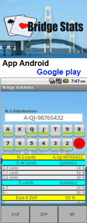

# JCardLib
A basic java lib for cards games, with exstensions for 52 Card sets and Bridge

The lib is general poupose, to handle hands and car set.
-  Level 1: Cardset, card52: for generic Cards, and for 52 card set (Franch)
-  level 2: BridgCardSet, bridgeProbs, for Bridge: random hands, impor/export hands in PBN, score calculator, probabilities...etc.
-  level 3: TestCard01, TestCards02, TestCards03 examples/test programs: some outputs in test-output dir.

This library is used in BridgeStats, an app for Android

